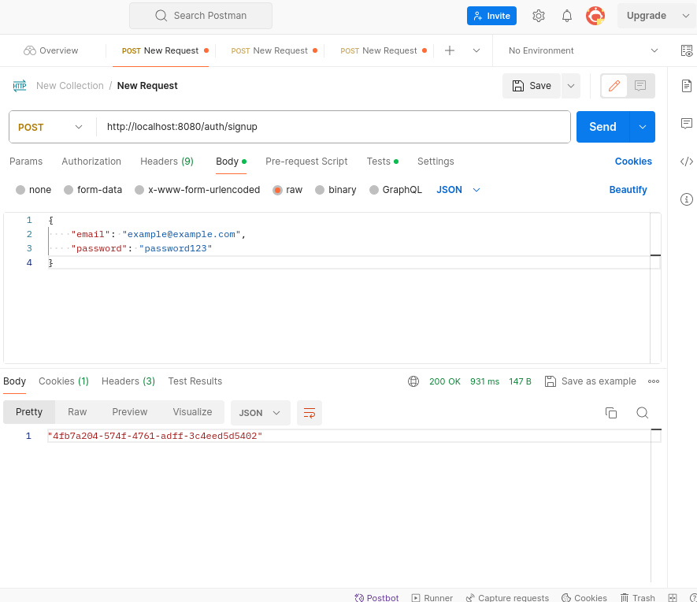
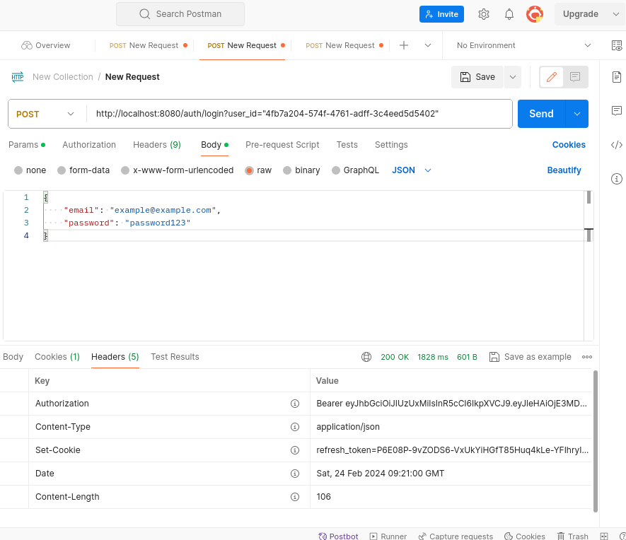
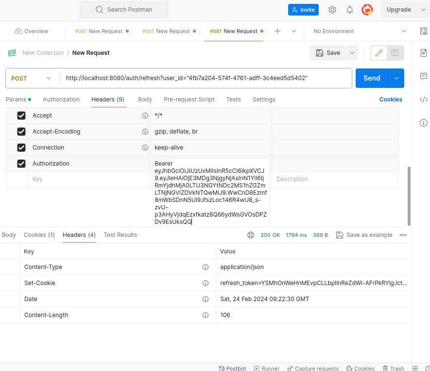

# Test task BackDev

**Используемые технологии:**

- Go
- JWT
- MongoDB

## Запуск

Клонируем репозиторий

```sh
git clone https://github.com/v7ktory/test-exercise.git
cd test
```

команда make собирает приложение и запускает в докер контейнере
команда make stop останавливает приложение и удаляет контейнеры

```sh
make
make stop
```

если не хотим запускать приложение в докере, тогда в .env меняем MONGO_HOSTS="mongodb" на MONGO_HOSTS="localhost" и пишем команду

```sh
go run ./cmd/app/main.go
```

## Проверка приложения через постман




